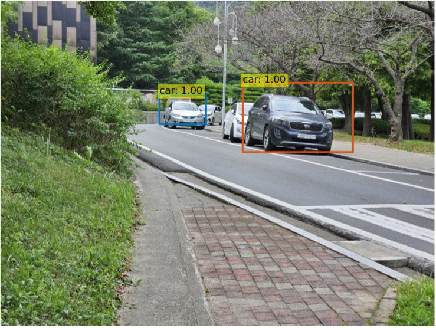
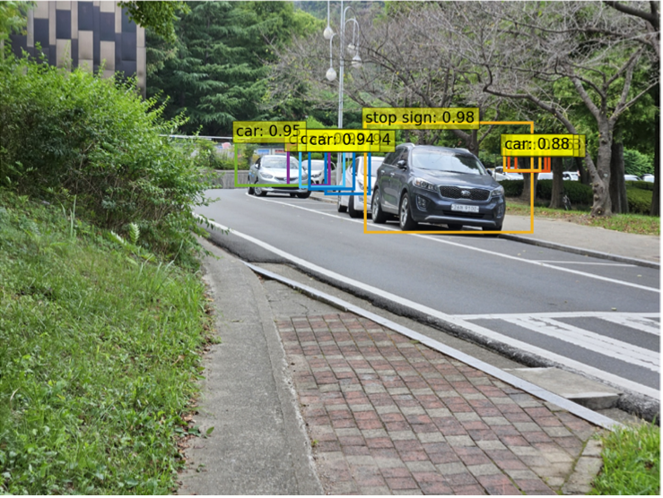
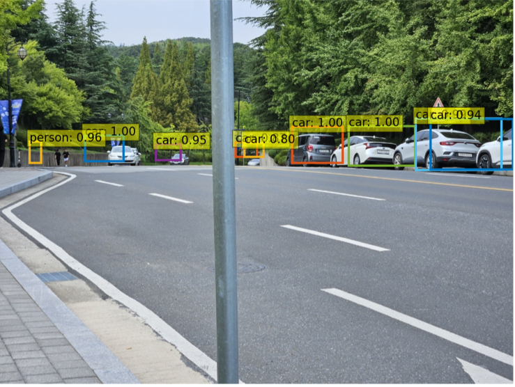
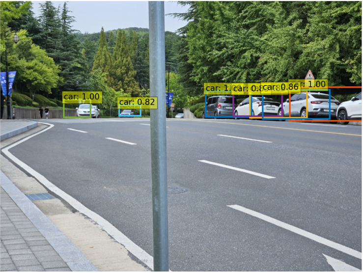
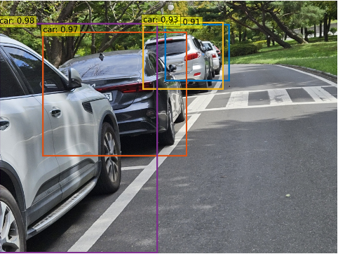
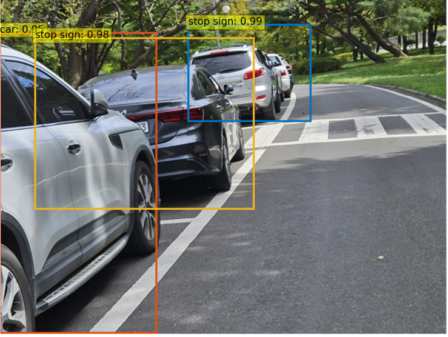

# SwinDETR

### Inference Test
Left: SwinDETR Image Inference / Right: DETR Image Inference
<br/>
<figure class="half">
    <a href="link"></a>
    <a href="link"></a>
</figure>
<figure class="half">
    <a href="link"></a>
    <a href="link"></a>
</figure>
<figure class="half">
    <a href="link"></a>
    <a href="link"></a>
</figure>
<br/>
SwinDETR captures detailed local information (small objects) more effectively and performs well on detection than DETR.
Compared to DETR, SwinDETR is less likely to misjudge that there are objects in the background around small objects, and less likely to misjudge the class of small objects.

### Directory Structure
```
└── SwinDETR
    ├── args.py
    ├── coco
    │   ├── annotations
    │   │   ├── instances_train2017.json
    │   │   └── instances_val2017.json
    │   ├── train2017
    │   └── val2017
    ├── csv_analysis.py
    ├── datasets
    │   ├── __init__.py
    │   ├── dataset.py
    │   └── transforms.py
    ├── eval_densenet.py
    ├── eval_swin_t.py
    ├── inference_image.py
    ├── inference_video.py
    ├── inference_video_with_alert.py
    ├── models
    │   ├── __init__.py
    │   ├── backbone.py
    │   ├── criterion.py
    │   ├── densenet.py
    │   ├── matcher.py
    │   ├── positional_encoding.py
    │   ├── swin_detr.py
    │   ├── swin_transformer.py
    │   └── transformer.py
    ├── train_densenet.py
    ├── train_densenet.sh
    ├── train_swin_t.py
    ├── train_swin_t.sh
    └── utils
        ├── __init__.py
        ├── box_ops.py
        └── misc.py

9 directories, 28 files
```
### Needed Libraries
```
pip install torch torchvision opencv-python scipy einops matplotlib pycocotools tensorboard
```
