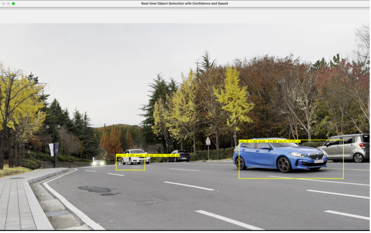

# SwinDETR & SwinDETR-Based Real-Time Object Detection

## Abstract
This study proposes a novel Real-Time Object Detection model to enhance pedestrian safety at the three-way intersection in front of the Cheongam-ro CHANGE-UP GROUND. Cheongam-ro is a major road frequently used by both university members and external vehicles. Due to the high traffic volume and fast vehicle speeds, it creates a challenging environment for pedestrians to cross safely at the crosswalk. To address this issue, this study designed the 'SwinDETR' model, which uses the Swin Transformer as the backbone of DETR, to improve object detection performance in road environments.

The study identified the limitations of the original DETR, particularly its lack of performance in detecting small objects, attributing this to constraints in feature map resolution and the global processing nature of the Transformer. SwinDETR compensates for these limitations, demonstrating superior small object detection capabilities. Performance comparisons between SwinDETR and the conventional CNN-based DETR showed that SwinDETR outperformed DETR in evaluation time and inference tests using images of Cheongam-ro and campus roads, particularly for small object detection.

Based on the SwinDETR model, the study developed a Real-Time Object Detection system capable of measuring not only object classes and bounding boxes but also object speeds and distances through software. This model was further applied to analyze traffic conditions and implement a traffic information system. Two hours of traffic footage from Cheongam-ro were recorded and analyzed using Real-Time Object Detection to collect traffic data and test the traffic information system, successfully verifying its practicality.

The main contributions of this study are as follows:
- Designing the 'SwinDETR' model to improve small object detection performance and introducing a novel Object Detection Architecture (Transformer-Transformer).
- Collecting cumulative traffic data based on Real-Time Object Detection, enabling effective alternatives for pedestrians to avoid road congestion and traffic accident risks based on time-specific traffic statistics.
- Implementing a traffic information system around the Changam-ro crosswalk, allowing pedestrians to directly assess road conditions:
    - Expansion of the system to major campus roads.
    - Provision of traffic accident prevention measures for not only vehicles but also small vehicles (motorcycles, scooters, bicycles, etc.).

## Model Overview

### Description
DETR (Detection with Transformers) is a novel end-to-end object detection model that incorporates Transformer architecture and bipartite matching. DETR does not require additional libraries for detection (e.g., Non-Maximum Suppression, Anchors) and, thanks to the characteristics of Transformers, offers several advantages over traditional CNN-based detection architectures. However, DETR shows a 5.5-point lower performance in small object detection (APS) compared to a CNN-based detection architecture like Faster R-CNN. This study identifies the following reasons for this limitation:

1. Feature Map Resolution Limitation:
DETR uses CNN models (e.g., ResNet-50, ResNet-101) as its backbone, and the feature maps extracted from the CNN are used as input to the Transformer structure (forming a CNN-Transformer architecture). Due to downsampling in CNNs, the feature maps tend to have relatively low resolution, making it easier to lose fine details of small objects.
2. Global Processing Nature of Transformers (Self-Attention):
Transformers learn pixel-wise correlations across the entire image through self-attention, which enables global context learning by considering overall relationships at once. While this is advantageous for understanding the overall structure and patterns of an image, it limits the ability to capture fine-grained local details. Small objects in images typically occupy spatially restricted regions where detailed information is densely packed, making the global processing nature of Transformers a potential cause of performance degradation in small object detection.
To address the small object detection performance issues of DETR, the Deformable-DETR model was proposed, which improved performance compared to DETR. However, it still relies on a CNN backbone, which processes detection based on low-resolution feature maps, thereby retaining its limitations.

To overcome the two main limitations of the original DETR and achieve superior performance in both small and large object detection, this study proposes the 'SwinDETR' model, which adopts a Transformer (Swin Transformer) as the backbone for DETR, forming a Transformer-Transformer architecture. While Vision Transformer (ViT) could also be considered as a backbone, ViT divides input images into fixed-size patches and processes them as tokens, making it less suitable for tasks like object detection that involve visual elements of varying scales. Therefore, the Swin Transformer model was chosen as the backbone for this study.

The Swin Transformer divides input images into small patches and hierarchically merges adjacent patches as the Transformer layers deepen, generating hierarchical feature maps. This approach is similar to the Feature Pyramid Network (FPN) in CNNs, which combines high-resolution detailed information with low-resolution abstract information, effectively handling visual features of varying sizes and resolutions in input images. This design addresses both limitations of the original DETR.

Additionally, the Swin Transformer employs Shifted Window Self-Attention, where input images are divided into fixed-size windows for local self-attention. The windows are then shifted and overlapped to allow information exchange between windows. This method combines local and global context information while reducing computational complexity. By leveraging both the local filtering capabilities of CNNs and the global self-attention of Transformers, the Swin Transformer is well-suited for object detection tasks.

### Model Structure

When the embed dimension (hidden_dim) of the DETR Transformer Encoder is matched to the final feature map channel size of Swin-T, which is 768, the final feature map of Swin-T can be used as input to the DETR Transformer Encoder. In this case, the size of the input feature map (src) for the DETR Transformer Encoder is set to (49, B, 768).

### Inference Test
- Left: SwinDETR Image Inference / Right: DETR Image Inference
<br/>
<figure class="half">
    <a href="link"></a>
    <a href="link"></a>
</figure>
<figure class="half">
    <a href="link"></a>
    <a href="link"></a>
</figure>
<figure class="half">
    <a href="link"></a>
    <a href="link"></a>
</figure>
<br/>
SwinDETR captures detailed local information (small objects) more effectively and performs well on detection than DETR.
Compared to DETR, SwinDETR is less likely to misjudge that there are objects in the background around small objects, and less likely to misjudge the class of small objects.

### SwinDETR-Based Real-Time Object Detection



## Environment Setup

### Directory Structure
```
└── SwinDETR
    ├── args.py
    ├── coco
    │   ├── annotations
    │   │   ├── instances_train2017.json
    │   │   └── instances_val2017.json
    │   ├── train2017
    │   └── val2017
    ├── csv_analysis.py
    ├── datasets
    │   ├── __init__.py
    │   ├── dataset.py
    │   └── transforms.py
    ├── eval_densenet.py
    ├── eval_swin_t.py
    ├── inference_image.py
    ├── inference_video.py
    ├── inference_video_with_alert.py
    ├── models
    │   ├── __init__.py
    │   ├── backbone.py
    │   ├── criterion.py
    │   ├── densenet.py
    │   ├── matcher.py
    │   ├── positional_encoding.py
    │   ├── swin_detr.py
    │   ├── swin_transformer.py
    │   └── transformer.py
    ├── train_densenet.py
    ├── train_densenet.sh
    ├── train_swin_t.py
    ├── train_swin_t.sh
    └── utils
        ├── __init__.py
        ├── box_ops.py
        └── misc.py

9 directories, 28 files
```
- Train: train_swin_t.py / train_densenet.py<br/>
- Evaluation: eval_swin_t.py / eval_densenet.py<br/>
- Inference: inference_image.py / inference_video.py / inference_video_with_alert.py<br/>

### Needed Libraries
```
pip install torch torchvision opencv-python scipy einops matplotlib pycocotools tensorboard
```

### Dataset
In this study, the COCO 2017 Dataset was utilized to train the SwinDETR model for the Object Detection Task. The COCO 2017 Dataset occupies approximately 37GB of storage, including all images and annotations. It consists of over 330,000 images (Train Set: ~118,000, Validation Set: ~5,000, Test Set: ~41,000, Unlabeled Data: ~123,000) and includes a total of 80 classes, such as humans, animals, vehicles, and household appliances, along with approximately 1.5 million object annotations. These annotations provide detailed information for each object, such as bounding boxes.
- Link: [COCO 2017 Dataset](https://cocodataset.org/#home)<br/>

## Reference
- DETR: End-to-End Object Detection with Transformers<br/>
  GitHub: [DETR](https://github.com/facebookresearch/detr)
- Swin Transformer: Hierarchical Vision Transformer using Shifted Windows<br/>
  GitHub (official): [Swin-Transformer](https://github.com/microsoft/Swin-Transformer)<br/>
  GitHub: [Swin-Transformer](https://github.com/csm-kr/swin_transformer_pytorch)
